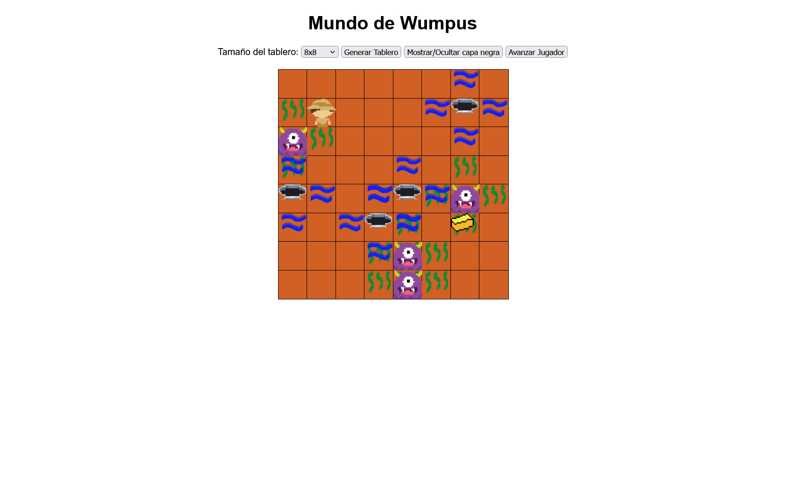

# 🏹 Wumpus World JavaScript / Mundo de Wumpus

---

## 🖼️ Gameplay / Captura del Juego

---

## 🇬🇧 English

### 📖 About the Project

This project is a web-based implementation of the **Wumpus World**, a classic problem in Artificial Intelligence environments. It simulates an agent navigating a grid-based world containing a monster (Wumpus), bottomless pits, and gold.

The application visualizes the logical rules of the environment, allowing users to observe the agent's interaction with perceptions like **Stench** (indicating a nearby Wumpus) and **Breeze** (indicating a nearby Pit).

### ✨ Key Features

* **Dynamic Board Generation**: Customizable grid sizes from 8x8 to 12x12.
* **Fog of War**: A toggleable "Black Layer" mechanic that simulates the agent's limited vision, revealing cells only as they are explored.
* **Game Mechanics**:
  * **Win Condition**: Find the Gold and return to the starting cell (0,0).
  * **Lose Condition**: Falling into a Pit or being eaten by the Wumpus.
* **Interactive Controls**: Buttons to generate new worlds, toggle visibility, and advance the agent.
* **Responsive Sprites**: Visual indicators for the Agent, Gold, Wumpus, Pits, Stench, and Breeze.

### 🛠️ Technologies Used

* **HTML5**: Structure and layout.
* **CSS3**: Styling, grid systems, and sprite layering.
* **JavaScript (Vanilla)**: Game logic, DOM manipulation, and state management.

---

## 🇪🇸 Español

### 📖 Sobre el Proyecto

Este proyecto es una implementación web del **Mundo de Wumpus**, un problema clásico en entornos de Inteligencia Artificial. Simula a un agente navegando por un mundo en cuadrícula que contiene un monstruo (Wumpus), hoyos sin fondo y oro.

La aplicación visualiza las reglas lógicas del entorno, permitiendo a los usuarios observar la interacción del agente con percepciones como **Hedor** (indicando un Wumpus cercano) y **Brisa** (indicando un Hoyo cercano).

### ✨ Características Clave

* **Generación Dinámica de Tableros**: Tamaños de cuadrícula configurables de 8x8 a 12x12.
* **Niebla de Guerra**: Mecánica de "Capa Negra" conmutable que simula la visión limitada del agente, revelando celdas solo a medida que son exploradas.
* **Mecánicas de Juego**:
  * **Condición de Victoria**: Encontrar el Oro y regresar a la casilla de inicio (0,0).
  * **Condición de Derrota**: Caer en un Hoyo o ser comido por el Wumpus.
* **Controles Interactivos**: Botones para generar nuevos mundos, alternar visibilidad y avanzar el agente.
* **Sprites Responsivos**: Indicadores visuales para el Agente, Oro, Wumpus, Hoyos, Hedor y Brisa.

### 🛠️ Tecnologías Usadas

* **HTML5**: Estructura y maquetación.
* **CSS3**: Estilos, sistemas de grid y superposición de sprites.
* **JavaScript (Vanilla)**: Lógica del juego, manipulación del DOM y gestión de estados.

---

## 👥 Authors / Autores

This project was developed by: / Este proyecto fue desarrollado por:

|                                                                                                                                        **David Pinto Gómez**                                                                                                                                        |                                                       **PaulaRR2000**                                                       |
| :--------------------------------------------------------------------------------------------------------------------------------------------------------------------------------------------------------------------------------------------------------------------------------------------------------: | :--------------------------------------------------------------------------------------------------------------------------------: |
| ` ` |  |

---

### 🔗 Links

* **Web Page**: [https://pintomultimedia2002.github.io/wumpus-world-javascript/](https://pintomultimedia2002.github.io/wumpus-world-javascript/)

